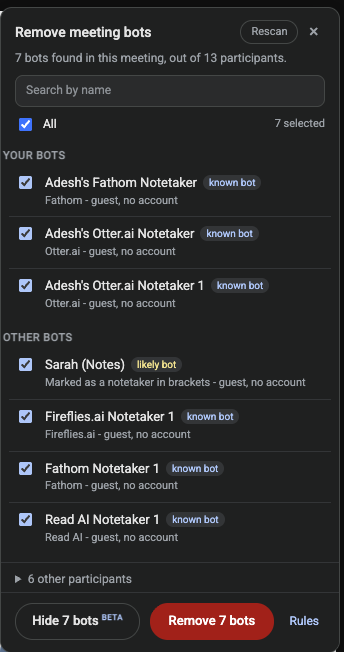

# Remove Meeting Bots

A Chrome extension that finds AI notetaker bots in your Google Meet call and
removes them all in one click.

During a call you get a **Bots** button next to Meet's participant count, top
right. Click it and you get the list of bots it found, every one ticked. Untick
any you want to keep, hit **Remove**, and it walks the participant menu for each
of them while you watch the status update live.



## What it does

- **Detects two tiers**, both shown with the reason: **known bot** (Otter,
  Fireflies, Fathom, Read AI, tl;dv, and ~45 more) and **likely bot** (a bot
  shape without a brand: "Notetaker", "Meeting Recorder", "Sarah (Notes)").
  Deliberately narrow: a missed bot costs one extra tick, a colleague queued
  for removal costs far more.
- **Your bots first.** Notetakers you sent yourself (Meet names them
  possessively, "Adesh's Fathom Notetaker") are listed in their own section.
- **Hide bots (Beta)**: hides the ticked bots' video tiles from your own view,
  and nobody else's, whether or not you are the host. **Show them again** puts
  them back.
- **Honest about permissions.** Removing needs host rights: the extension
  grants you nothing you do not already have, it just clicks faster. As a
  guest it says so up front and holds Remove back, with **Try anyway** for
  calls where host management is off.
- **Your own rules**, on the options page: always-treat-as-bot patterns for
  in-house notetakers, and a never-remove list that beats everything else.
- Google's own Gemini notetaker is detected but greyed out; stop it from the
  Meet toolbar instead.

## Install

Until it is on the Web Store, build it from source (Node 22+, pnpm):

```sh
pnpm install && pnpm build
```

Then `chrome://extensions` -> **Developer mode** -> **Load unpacked** ->
select `build/chrome-mv3`, and join a call.

## Permissions and privacy

| Permission | Why |
| --- | --- |
| `https://meet.google.com/*` | Read the participant list and click the remove controls. |
| `storage` | Save your custom rules (synced with your Chrome profile). |
| `scripting` | Inject into a Meet tab that was already open at install time. |

Nothing leaves your browser: no server, no analytics, no network requests of
any kind. The full policy is in [PRIVACY.md](PRIVACY.md).

## Known limits

Google Meet ships unversioned, generated markup, so the selectors are
defensive but not future proof. When a Meet update breaks something the
failure is loud, not silent: rows report "failed" with the reason. The usual
causes: you are not the host, Meet is in a language the label tables do not
know yet, or Meet changed its markup.

## Developers

Architecture, the captured Meet DOM facts, the six test suites, fixtures for
testing without a real call, and how releases ship: it all lives in
[docs/DEVELOPMENT.md](docs/DEVELOPMENT.md). MIT licensed ([LICENSE](LICENSE)).
